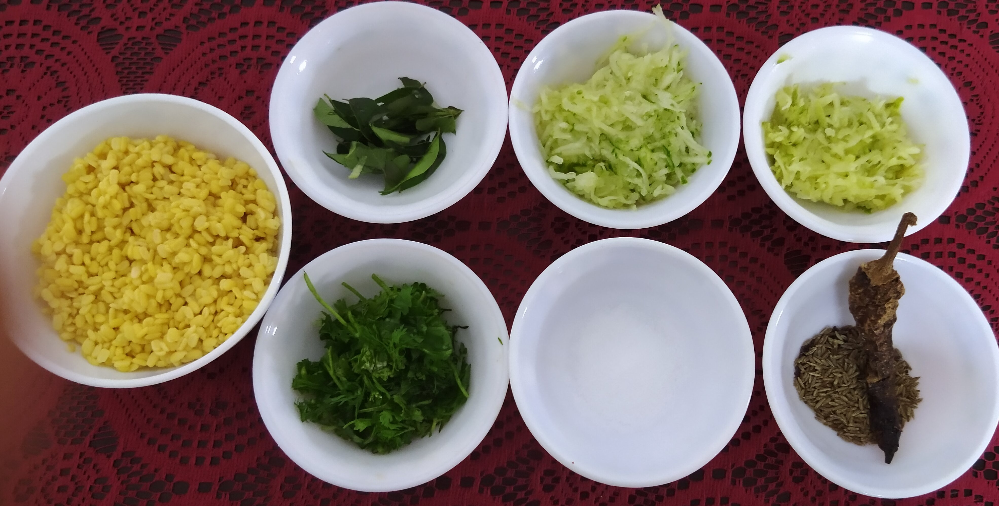
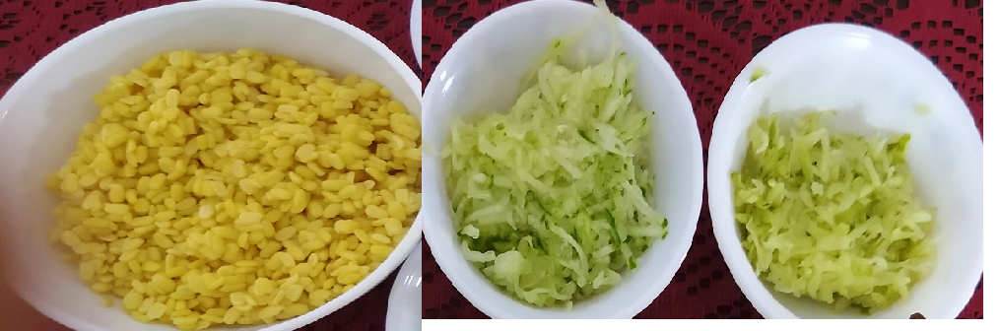
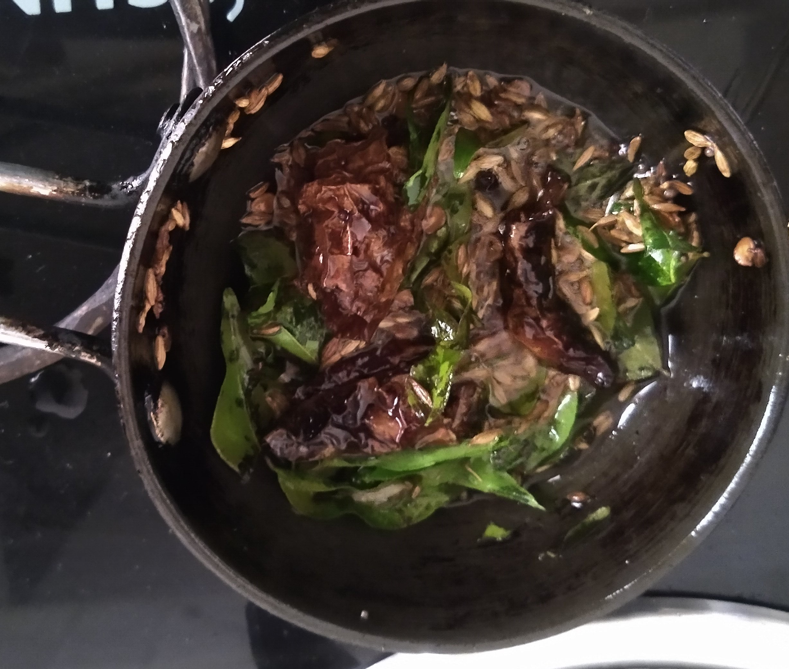
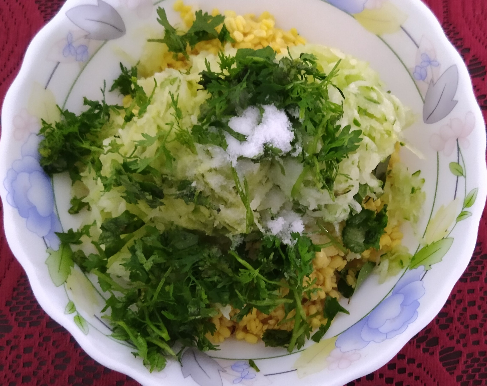
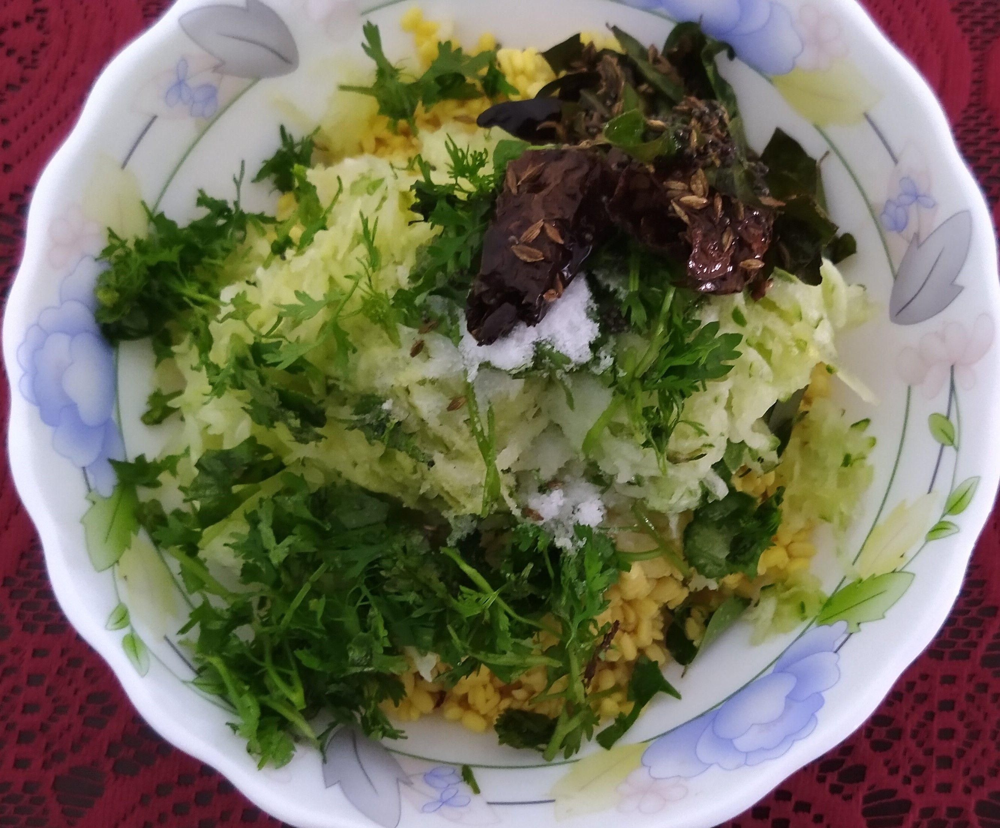
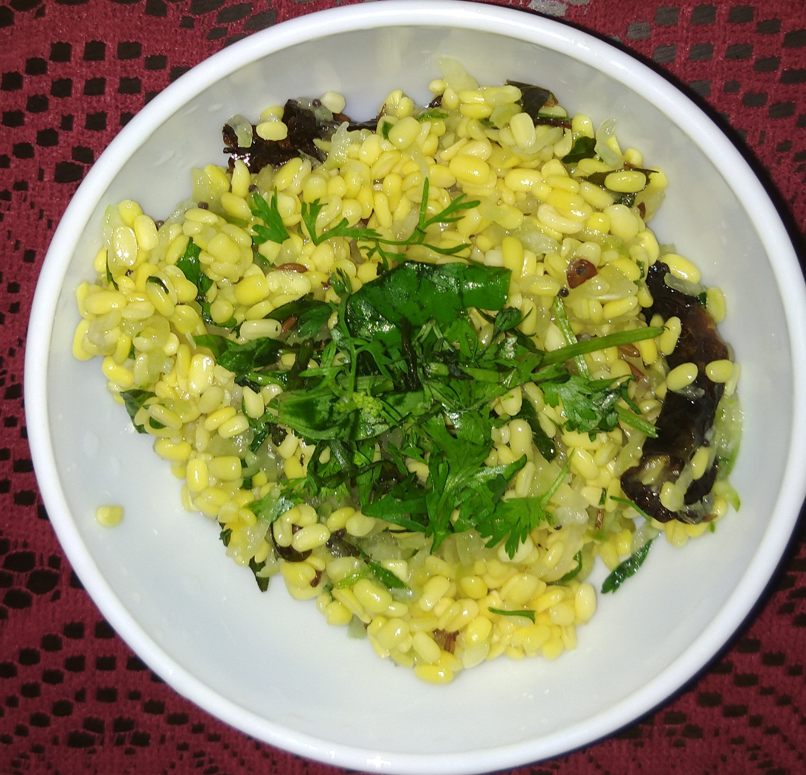

# Moongdal Salad
## Overview

Kosambari(salad) is a simple which is popular in karnataka
on occasion of every festive or wedding. Moongdal kosambar is a
 delicious protein rich to loose weight content. It is offered as 
 naivedyam to Lord Rama on occasion of Ramnavami.

## Ingredients

Ingredient | Quantity 
------- |:-------:
Moongdal soaked in water for 1-2hrs | 1 cup   
Cucumber | 1 cup
Grated kaccha mango | 1/2 cup  
Coriander leaves  | 1 handful fist 
Salt | To taste    

### For seasoning   
Ingredient | Quantity 
------- |:--------:
Jeera | 2tbsp    
 Hing |2tbsp   
 Curry leaves |1 cup
 Vegetable oil|3 4 tbsp  
 Red chilli | 1-2

## Preparation

1.Rinse moong dal in cold water, add 1 1/2 cup of water and soak it for 1 hr
 Wash cucumber and Kaccha mango, grate cucumber and mango , chop the coriander and set it aside1.After an hour drain the moong dal and set it aside

2	Take a kadai , add 1-2tbsp of oil to it and heat, then add jeera , curry leaves, hing, chilli and saute it for 1 minute.Allow it to cool.

3	Take a bowl add drained moongdal, cumcumber, grated kaccha mango, salt to it and mix it

 4.Then add the seasoning ,if needed add grated coconut and then again mix it. 

5 serve it
