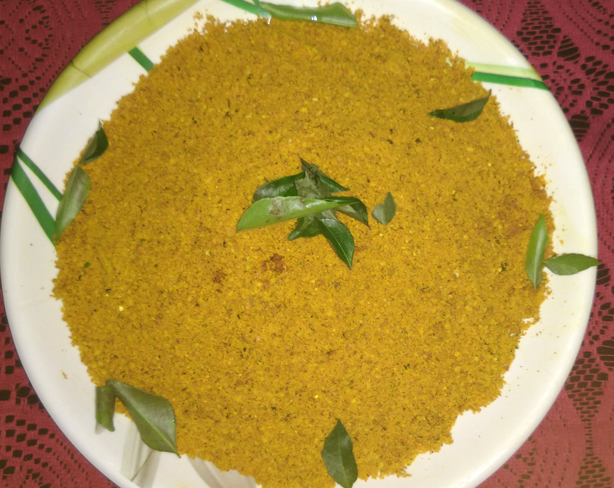

# Orange flavoured Chutney Pudi
## Overview

Chutney powder is a dry chutney recipe which is prepared with urad dal,
curryleaves,hing etc.It is served with dosa,rice with ghee,idli. 
These are called as life savers and can be used as replacement of chutney. 

## Ingredients

Ingredient | Quantity 
------- |:--------:
Groundnut seeds | 2 cups
Bengal gram | 1 cup
Uraddal |1cup
Til | 1 cup
Chickpeas | 1 cup
 Tamarind |1 small ball
Jeera |2tbsp
 Haldipowder |1tbsp
 Grated dry coconut|1 cup
 Grated jaggery |2tbsp
 Dried orange skin|1/2 cup
 Hing |2tbsp
 Curry leaves |1 cup
 Dry chilli powder|1/2 cup
 Salt |as required
 Vegetable oil|3 4 tbsp

## Preparation

1.  Dry roast the groundnut seeds,til, grated coconut separately and remove it on one plate 

1.	Take a kadai add 3 tbsp of oil and switch on the gas. Allow the oil to heat, then add Bengal gram, urad dal, curry leaves,jeera, dried orange skin ,tamarind and remove it on the same plate.

1.	Then mix the remaining ingredients (haldipowder,jaggery,chillipowder,chickpeas,hing, salt).

1.	Mix all the ingredients well and grind it into fine powder.

1.	Allow it to cool and store it in tight container . Serve it with chapati, dosa etc.

