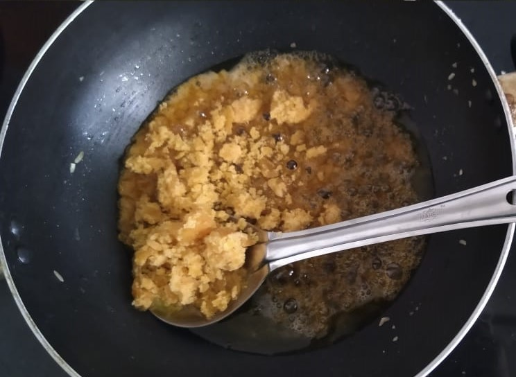
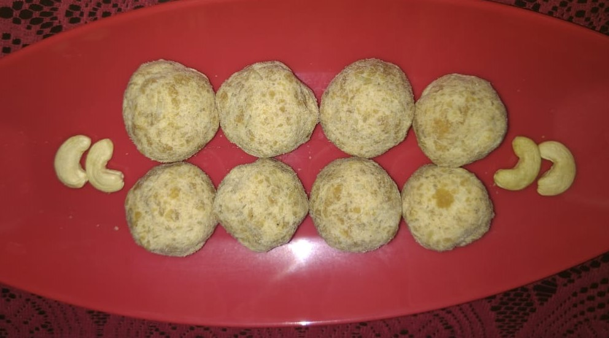

# Ram (wheat flour)laddu
## Overview

This is one of the healthy food that is prepared during the occasion of Ramnavami in north karnataka.This is prepared by using wheatflour,ghee and jaggery.It is one of the saviour when hunger strikes.

## Ingredients

Ingredient | Quantity 
------- |:--------:
Wheatflour|1 cup
Ghee|1 cup
 Grated Jaggery|1 1/2 cup
Elaichi Powder|2-3 tbsp
Thick poha|1 cup

## Preparation

1. Allow ghee to heat in a deep pan and add thick poha to roast .Continue Roasting poha till it turns mild brown and remove it to a plate  and set aside to cool down.

1.	Add 1tbsp of ghee, wheat flour in a kadai and begin it to roast on a medium heat 
stirring continously untill a nice aroma comes out. 
Once it turns into aromatic reduce the flame to lowest and keep roasting continuosly untill it turns deep golden colour. 
Separate the roasted wheat flour from kadai into the plate and keep it aside to cool.

1.Add remaining ghee to kadai to melt and then add grated jaggery to it , stir till the jaggery melts to soft syrup in a low flame. 

1. Add roasted wheat flour, elaichi powder,and roasted poha to the syrup and mix it well uniformily and allow it to cool. 
Knead the mixture well with hands .

1. Take the small portions of mixture to your palm and press gently to give the shape of laddu,if in need u can add 1-2 tpsp of melted ghee. 
Store them in tight jar and serve them when needed.

