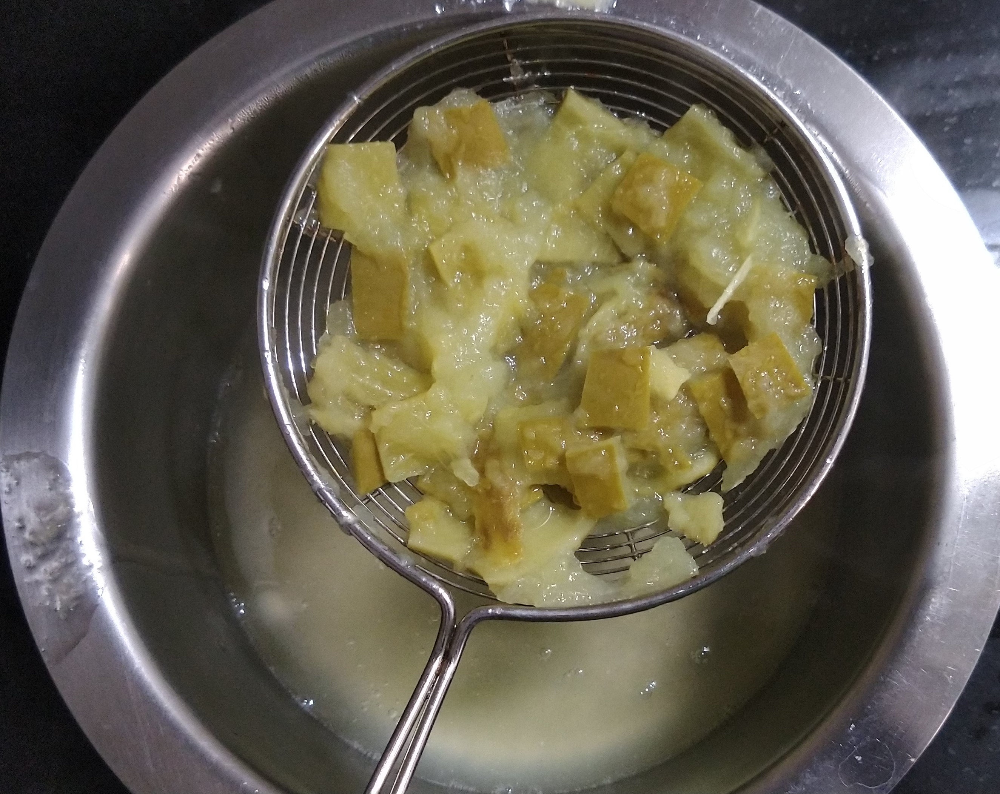
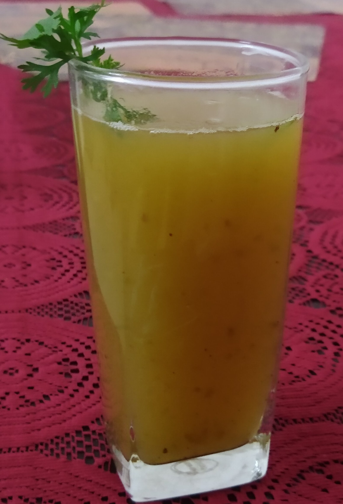

# Raw Mango Juice
## Overview

Raw mango juice is one of refreshing summer drink prepared by raw mango.It can be stored for about a weeks.It contains of high vitamin C which acts in controlling blood pressure,relieving constipation and for digestion.It mainly acts as a energy booster .
## Ingredients

Ingredient | Quantity 
------- |:--------:
Raw Mango pieces|1cup
Grated Jaggery|1 1/2 cup
Elaichi Powder|2-3 tbsp
Salt|1-2tbsp

## Preparation

1.Wash Raw mango in running water and cut it into medium
 pieces. In Pressure cooker add these pieces along with seed(most
  of the people throw a seed away, but if we look lot of 
 taste comes from this seed) by adding 1 cup of water.Pressure cook it
for about 3-4 whistles and allow it to cool down. 

Note:(Most of the people throw a seed away, but if we look lot of 
 taste comes from this seed)

1.	Once cooled smash the pulp and remove the remaining pulp extract 
from seed . Strain the pulp to separate concentrated juice from pulp.
 
 

1. Transfer the strained pulp into mixer then add grated jaggery and
  grind  it into smooth paste.
  
  

1. Transfer the grinded smooth paste into the concentrated juice
   , add salt, elaichi powder and mix it well.Now concentrated juice is ready.
    
   

1.  Add required water,taste for salt and jaggery and adjust as per
     your taste.Chill it if desired and serve it
     
   

