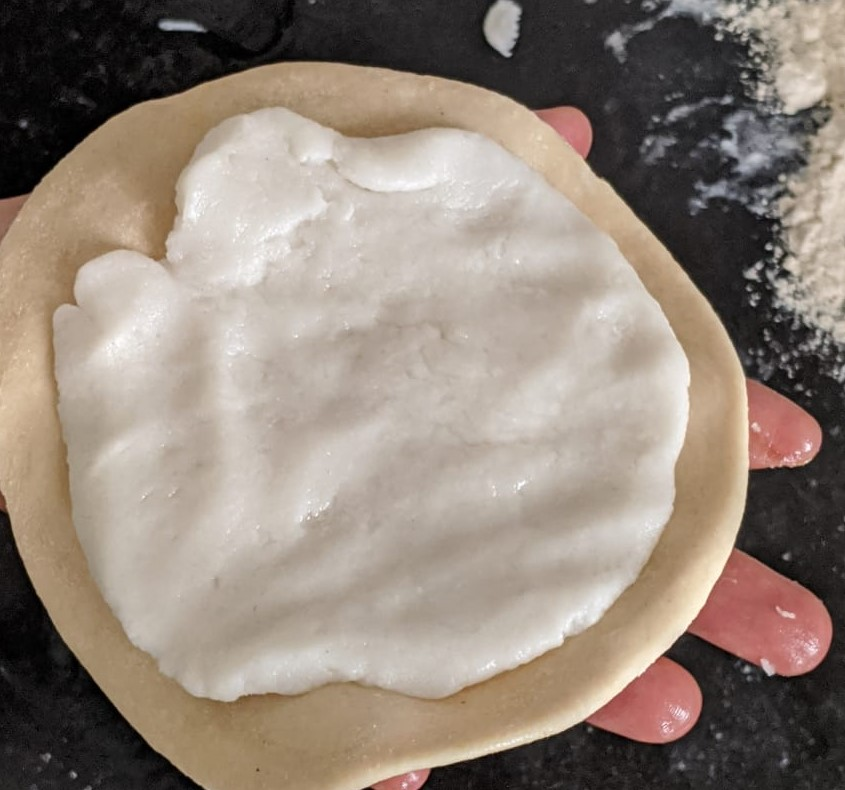

Rice flour stuffed Paratha(Hittina Holige)
## Overview
Bili Holige is one of the popular breakfast in karnataka. It is also called as Hittina holige in kannada.These are not sweet dishes compared to anotherPuran polis(holige).It can served with curry or chutneyIt is very easy to prepare .Generally this holige is served with mango shikarani(sweet dish prepared using mangoes in mango season)
## Ingredients

Ingredient | Quantity 
------- |:--------:
Wheat flour | 1 cup
Maida | 1/2 cup
Rice flour | 2 cup
Oil | 1/2 cup
salt| As required

## Preparation

1.Take maida, wheat flour,1tbsp of oil and a pinch of salt  and mix it . 

2 Knead it into a smooth dough by adding required water .At the end add 1tbsp of oil ,knead it again and keep it aside for 1hr.

3 Now in a deep frying pan take 2 1\2 cups of water , add salt and 1tbsp of oil to it. Keep it for boiling

4 When it starts boiling add rice flour and stir continuously.

5 Switch off the stove and cover it with lid. Once cool knead the rice flour dough with hands nicely.

6 Apply oil to the palm and fingers, take a small size dough and make it flat.Place a stuffing over it.

7 Carefully fold all the sides of the dough so that rice dough stuffed inside . Press it gently to flatten it.

8 Roll the dough by dusting with wheat flour using rolling pin caefully.

9 Heat a pan , once it heated place the rolled holige or paratha on it, apply oil on it

10 When the bubbles start appearing flip it on other side ,cook on both sides

11 Serve it by applying ghee and with mango shikarani or curry

